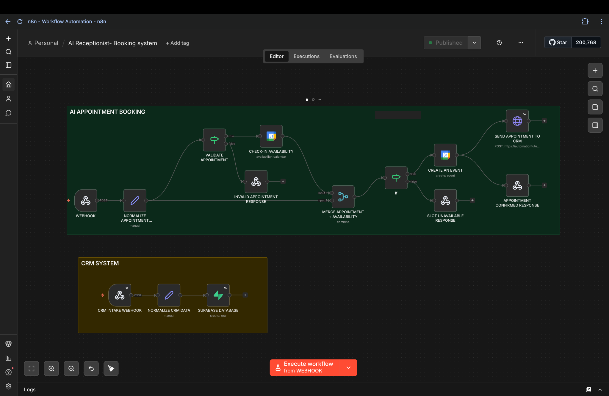
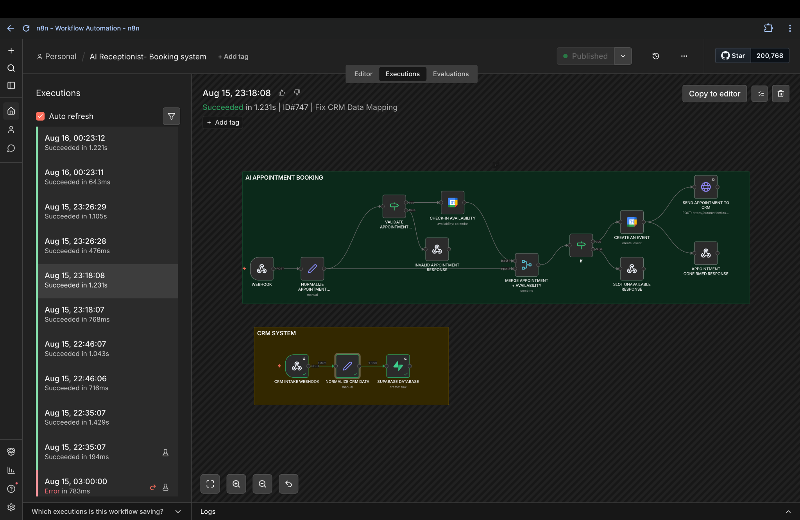
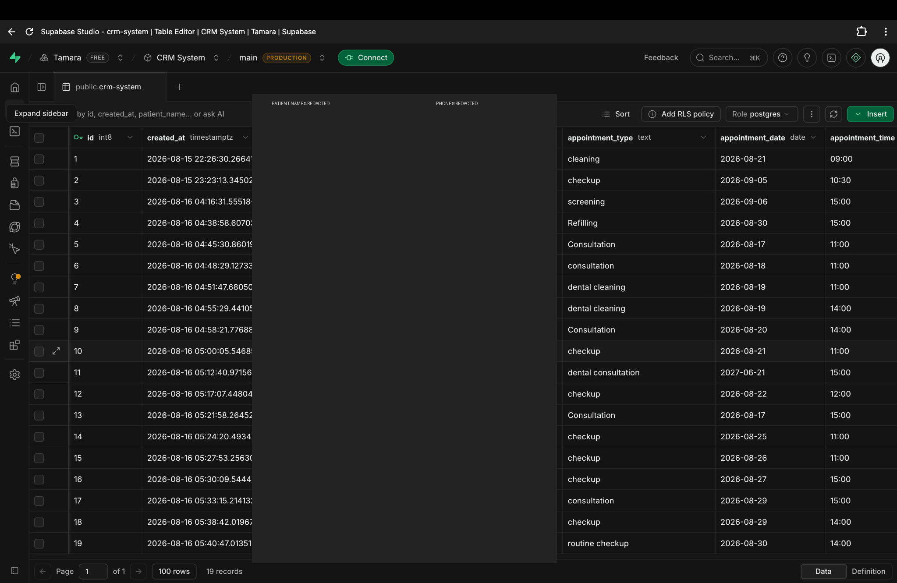
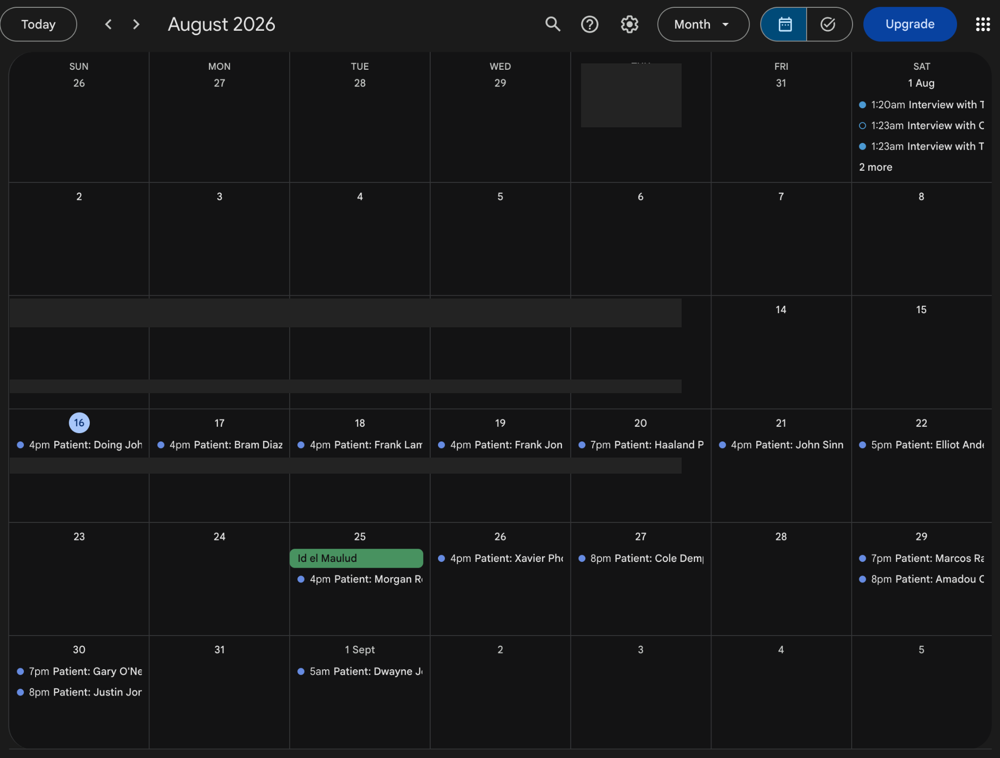
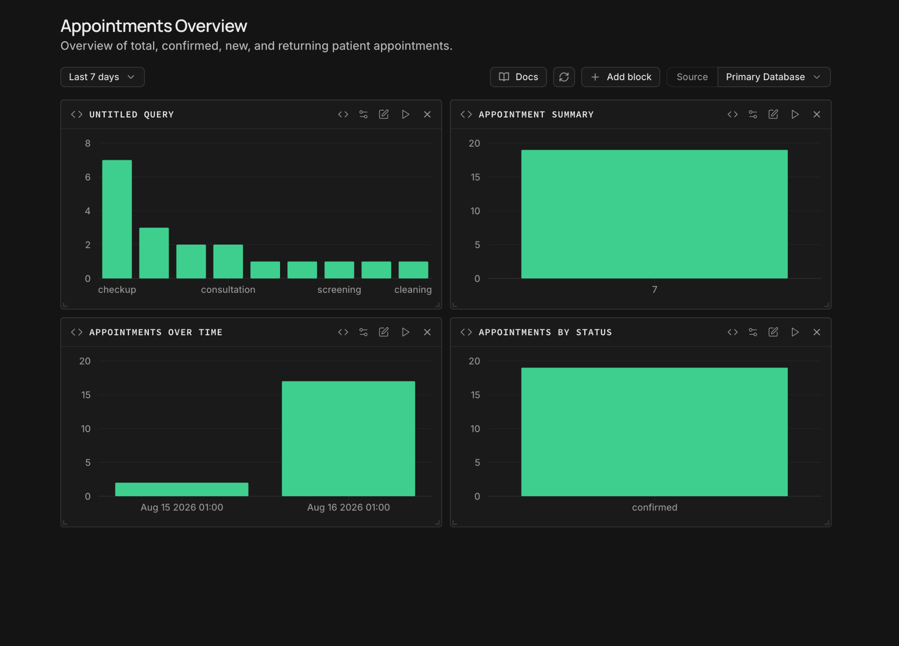

# AI Dental Voice Receptionist

An end-to-end **AI voice receptionist and appointment automation system** for dental clinics. It turns inbound phone conversations into structured appointment requests, validates the request, checks Google Calendar availability, creates confirmed bookings, writes the appointment into a Supabase CRM, and exposes appointment analytics through a reporting dashboard.

> **Portfolio project:** built to demonstrate practical AI Agent Development, CRM Automation, n8n Workflow Automation, API Integration, and business process automation.

## The problem

Dental reception teams spend a significant amount of time handling repetitive calls, collecting patient details, checking appointment availability, creating calendar events, and updating records manually.

That creates several operational problems:

- Missed or delayed calls during busy periods
- Repetitive manual data entry
- Scheduling conflicts and double-booking risk
- Inconsistent patient information capture
- CRM records that are not updated immediately
- Limited visibility into appointment activity

The goal of this project was to connect those steps into one automated flow without removing the human-friendly experience of a receptionist.

## Solution

The system uses an **AI voice receptionist** as the front door to the process. Once a caller requests an appointment, the conversation is converted into structured booking data and passed into an **n8n production workflow**.

The workflow then:

1. Receives the appointment request through a production webhook.
2. Normalizes the incoming patient and appointment data.
3. Validates the appointment request before scheduling.
4. Checks Google Calendar for availability.
5. Creates the calendar event when the requested slot is available.
6. Handles invalid requests and unavailable slots through separate response paths.
7. Sends the confirmed booking data into a Supabase CRM table.
8. Makes the resulting appointment activity available for reporting and visualization.

## Architecture

```text
                    ┌──────────────────────┐
                    │   Patient Phone Call │
                    └──────────┬───────────┘
                               │
                               v
                ┌────────────────────────────┐
                │ Vapi AI Voice Receptionist  │
                │ - Conversational intake    │
                │ - Appointment information  │
                └─────────────┬──────────────┘
                              │
                              v
                  ┌───────────────────────┐
                  │    n8n Production     │
                  │       Workflow        │
                  └──────────┬────────────┘
                             │
              ┌──────────────┼──────────────┐
              │              │              │
              v              v              v
       ┌────────────┐  ┌────────────┐  ┌──────────────┐
       │ Validation │  │  Calendar  │  │ Error / Slot │
       │ & Mapping  │  │ Availability│ │   Handling   │
       └────────────┘  └─────┬──────┘  └──────────────┘
                              │
                              v
                     ┌─────────────────┐
                     │ Google Calendar │
                     │ Create Booking  │
                     └────────┬────────┘
                              │
                              v
                       ┌──────────────┐
                       │ Supabase CRM │
                       │ Appointment  │
                       │   Records    │
                       └──────┬───────┘
                              │
                              v
                    ┌────────────────────┐
                    │ Reporting &        │
                    │ Appointment Charts │
                    └────────────────────┘
```

## Key features

### AI Voice Receptionist

The Vapi assistant handles inbound appointment conversations and collects structured information such as patient name, phone number, patient type, appointment type, preferred date, preferred time, and timezone.

### Appointment validation

Requests are normalized before the scheduling step so incomplete or invalid information does not flow directly into the calendar.

### Real-time availability checking

Google Calendar is used to check the requested slot before an event is created, reducing the risk of blindly booking an occupied time.

### CRM automation

Successful appointment data is sent into Supabase so the clinic has a persistent CRM record instead of relying on the calendar alone.

### Voice quality and transcription support

The receptionist uses background speech denoising and dental-domain transcription context to improve voice-input handling in a noisy environment. Automatic transcriber fallback is also enabled.

### Appointment analytics

The Supabase reporting layer includes views for:

- Appointment summary
- Appointments by type
- Appointments by status
- Appointments over time

## Technology stack

| Technology | Purpose |
|---|---|
| **Vapi** | AI voice receptionist and inbound phone interface |
| **n8n** | Workflow orchestration, validation, routing, and automation |
| **Google Calendar** | Availability checking and appointment creation |
| **Supabase / PostgreSQL** | CRM database and appointment reporting |
| **OpenAI** | Conversational reasoning for the AI receptionist |

## Repository structure

```text
ai-dental-voice-receptionist/
├── README.md
├── n8n/
│   └── appointment-automation.json
├── database/
│   └── supabase-schema.sql
└── screenshots/
    ├── appointment-dashboard.png
    ├── google-calendar.png
    ├── n8n-workflow.png
    ├── n8n-executions.png
    └── supabase-crm.png
```

## Screenshots

### 1. AI appointment automation workflow

The n8n workflow shows the production appointment path, including validation, availability checking, calendar creation, CRM delivery, and response handling.



### 2. Workflow executions

The execution view demonstrates successful production runs and makes it possible to inspect how the workflow behaves after a real request reaches n8n.



### 3. Supabase CRM

The CRM table stores structured appointment records after the automation completes.



### 4. Google Calendar

Confirmed appointment events are created in the connected calendar after availability is checked.



### 5. Appointment reporting dashboard

The reporting layer turns CRM records into appointment metrics and trends for operational visibility.



## Testing

The system was tested as an external-user flow rather than relying only on manual n8n execution.

A typical test follows this path:

```text
Caller
  ↓
Vapi receptionist
  ↓
n8n production webhook
  ↓
Validation + normalization
  ↓
Google Calendar availability check
  ↓
Calendar event creation
  ↓
Supabase CRM record
  ↓
Appointment reporting
```

This verifies that a real inbound call can trigger the production automation and produce a persistent CRM record.

## Reliability considerations

The workflow was designed with separate paths for invalid appointment data and unavailable slots. This prevents every request from being treated as a valid booking and gives the assistant a defined response when scheduling cannot proceed.

The voice layer also uses background denoising, domain context, and automatic transcriber fallback to improve the reliability of conversational intake.

## Security and privacy

This is a public portfolio repository. The repository intentionally excludes:

- API keys and access tokens
- n8n credential secrets
- Supabase service-role credentials
- Private calendar identifiers and secrets
- Webhook authentication secrets
- Real patient records and private call data

The screenshots included in the repository are sanitized for portfolio use. Demo records should be treated as synthetic/test data rather than production patient information.

## Future improvements

Potential production extensions include:

- SMS and email appointment reminders
- Rescheduling and cancellation flows
- Patient confirmation links
- Authentication and role-based CRM access
- Clinic-specific dashboards
- Monitoring and alerting for failed executions
- More advanced analytics and conversion metrics

## Portfolio positioning

This project demonstrates practical experience with:

**AI Agent Development · n8n Workflow Automation · CRM Automation · API Integration · Automated Workflow · Business Process Automation · Automation · Artificial Intelligence**
